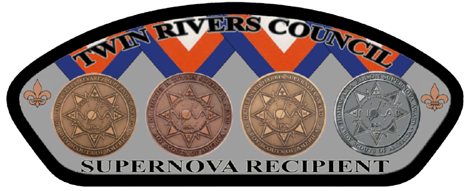

.. _introduction:

Welcome to Cub Scout Nova Week of the TRC!
++++++++++++++++++++++++++++++++++++++++++++

.. warning::

   **Welcome to the Twin Rivers Council Cub Scout Nova Quest website!**

   Here you will find all the information you need for each of the 11 Cub Scout Nova Awards offered during the Nova Quest program. Each Nova Award has its own page. Only focus on those for which of you have registered!

   How can you use this site? You will find contact information, the list of pre-requisites (i.e. things you should do before the Zoom meeting), a preview of the activities that will take place during the Zoom meetings, and links to submit your pre-requisites to the instructors! You will even find a few words about each instructor on each page. Isn't that cool?

   Most important: you will find the Zoom link on each page to join the meetings!

   If you have any question, please do not hesitate to contact us!

   **Contact info:**

   * Registration and other administrative aspects:
     
     * Tory Carman (email: Tory.Carman@scouting.org)

   * Co-organizers:

     * Rob Pattison (email: pattison_r@yahoo.com)
     * Greg Szczesny (email: glszczesny@gmail.com)
     * Vincent Meunier (email: twinriversstem@gmail.com)
    
.. admonition:: **Our Mission**

		The mission of the STEM committee is to  promote the STEM/Nova activities to all Youths of the Council by offering a rich array of STEM-related activities offered by technical experts and volunteers. The activities are positioned in large part, but are not limited to, BSA-sponsored activities. The STEM committee strives to offer a safe and inclusive atmosphere to all Cub Scouts, Scouts BSA, Venturers, and Sea Scouts.
	

		
+----------------+----------------+----------------+------------------+
| TRC            |                |                |                  |
| Cub            |                |                |                  |
| Scout Nova     |                |                |                  |
| Quest          |                |                |                  |
+================+================+================+==================+
| **Nova Award** | **Category**   | **Date/Time**  | **Instructor**   |
+----------------+----------------+----------------+------------------+
|:ref:`scievery` | Science        | 04/08 at       | Vincent          |
|                |                | 3:30pm         | Meunier          |
+----------------+----------------+----------------+------------------+
| :ref:`ttk`     | Technology     | 04/05 at       | Ted Sargent      |
|                |                | 3:30pm         |                  |
+----------------+----------------+----------------+------------------+
| :ref:`swing`   | Engineering    | 04/06 at       | Jeff Zemsky      |
|                |                | 3:30pm         |                  |
+----------------+----------------+----------------+------------------+
| :ref:`onetwo`  | Mathematics    | 04/10 at       | Rob Pattison     |
|                |                | 12:00pm        |                  |
+----------------+----------------+----------------+------------------+
|:ref:`downdirt` | Science        | 04/07 at       | Jeffrey Brewer & |
|                |                | 3:30pm         | James Cascione   |
+----------------+----------------+----------------+------------------+
| :ref:`nvw`     | Science        | 04/06 at       | Melissa          |
|                |                | 6:30pm         | Sargent          |
+----------------+----------------+----------------+------------------+
| :ref:`ootw`    | Science        | 04/05 at       | George Hassel    |
|                |                | 6:30pm         |                  |
+----------------+----------------+----------------+------------------+
| :ref:`ffs`     | Mathematics    | 04/08 at       | Melia Gordon     |
|                |                | 6:30pm         |                  |
+----------------+----------------+----------------+------------------+
| :ref:`utp`     | Science        | 04/07 at       | Katie McCabe     |
|                |                | 6:30pm         |                  |
+----------------+----------------+----------------+------------------+
| :ref:`cscc`    | Technology     | 04/09 at       | Ted Sargent      |
|                |                | 6:30pm         |                  |
+----------------+----------------+----------------+------------------+
| :ref:`euaway`  | Engineering    | 04/09 at       | Bill Clancy      |
|                |                | 3:30pm         |                  |
+----------------+----------------+----------------+------------------+

		

     
   Shoulder Patch Offered by the Committee for all Supernova Award recipients. More on the Supernova awards can be found `here <https://www.scouting.org/stem-nova-awards/awards/>`__. 

Go to Twin Rivers Council `website <https://www.trcscouting.org>`_. 
