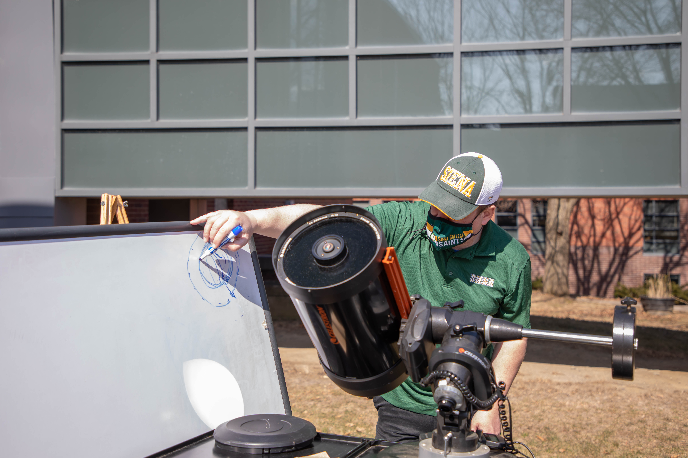

.. _ootw:
     
Out of this World
+++++++++++++++++

This module is designed to help the Cub Scout discover the wonders of space exploration.

.. note::
   **General Information about this activity:**

   * **When?**: 04/05 at 06:30pm
   * **Instructor**: George Hassel
   * **E-Mail address**: ghassel@siena.edu
   * **Bio-sketch**: George is an instructor of Physics and Astronomy at Siena College and enjoys outreach events with the Breyo Observatory.   He is the Webelos Den  Leader for Pack 1701 in Latham, and earned the rank of Eagle Scout in 1995 in Valley Forge Council (PA).  

Pre-requisites
--------------

What is a pre-requisite? It is an activity you should complete *before* the meeting! Here is a list of pre-requisites you should do to complete this Award. If you do not have time to complete it **before** the day of the activity, do not despair! You can always send your work later to your instructor at the address listed above!

1. Requirement #1. Watch an episode or episodes (about one hour total) of a show about the planets, space, space exploration, NASA, or astronomy. Then do the following:

   A. Make a list of at least two questions or ideas from what you watched.
   B. Discuss two of the questions or ideas with your counselor.

   .. note::

      **Here are some examples of appropriate videos:**

      * https://www.youtube.com/watch?v=Xwn8fQSW7-8&list=PL8dPuuaLjXtPAJr1ysd5yGIyiSFuh0mIL&index=17
      * https://www.youtube.com/watch?v=HaFaf7vbgpE&list=PL8dPuuaLjXtPAJr1ysd5yGIyiSFuh0mIL&index=18
      * https://www.youtube.com/watch?v=E8GNde5nCSg&list=PL8dPuuaLjXtPAJr1ysd5yGIyiSFuh0mIL&index=19
      * https://www.youtube.com/watch?v=1hIwD17Crko&list=PL8dPuuaLjXtPAJr1ysd5yGIyiSFuh0mIL&index=20
      * https://www.youtube.com/watch?v=yB9HHyPpKds&list=PL8dPuuaLjXtPAJr1ysd5yGIyiSFuh0mIL&index=22&t=29s
      * https://www.youtube.com/watch?v=NPEEQm7bzcI
      * https://www.youtube.com/watch?v=US_byEAbXP0&t=11s
      * https://www.youtube.com/watch?v=seXbrauRTY4&t=8s

What we will do during the meeting?
-----------------------------------

1. We'll talk about how to focus, make a diagram of the solar system, and draw some constellations.  We will use a planetarium software to then try to find them.

   .. note::

      If you want to practice with something ahead of time, https://stellarium-web.org/. and http://skymaps.com/.  are free

2. We will talk about Revolution, Orbit, Rotation and eclipses. Please bring a flashlight and some different sized balls to the online meeting. 

3. We'll do a presentation of the observatory and some of the research that is done there.

   Prof. Hassel pointing his telescope safely to project an image of the Sun. As a rule: never point a telescope or binoculars directly toward the Sun! In fact, if you watch the Sun, never do this without protective gears!

